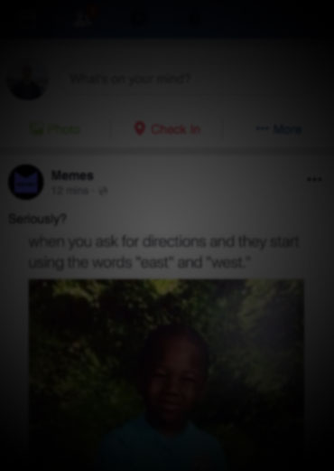

# Lights Out - Accessible Rich Internet Application
## An interactive experience

Interactive exercise to learn how to apply ARIA practices to web applications. Similar to interactive games like Flexbox Zombies and CSS Zen Garden, the goal of this project is to create an interactive experience where developers can learn how to apply Accessible Rich Internet Applications (ARIA) best practices.

## Motivation

As the world has become increasingly more digital there is a growing need to make these resources more accessible. Accessibility needs can vary and can include (but not limited to) visual, audio, and motor impairments.

Here's what the web looks like with visual impairments including partial blurry vision and partial blindness.

| Blurry Vision | Partial Blindness |
| :----: | :----: |
|  |  |

Audio impairments affect a user's recognition of alerts and make accessing media a challenge. Operating a mouse is difficult with motor impairments - which is why keyboard navigation is no longer optional. Additional impairments can affect cognitive recognition which is why designing a predictable user experience is noawadays a necessity.

## Concept

The application should demonstrate how the web is perceived with various impairments through creative storytelling. The story will unfold as the user (the developer) will be presented with challenges and solve them by applying ARIA attributes.

## Contribute

- [Have a suggestion or question?](https://github.com/coleturner/aria-lights-out/issues/new)
- [Pull requests are warmly welcomed.](https://github.com/coleturner/aria-lights-out/pulls)